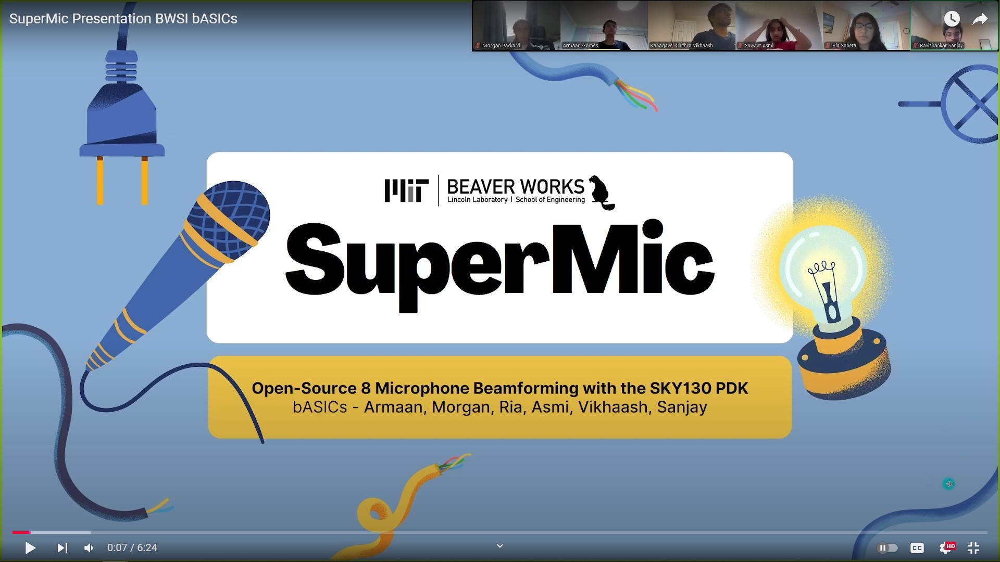

# Supermic+more: PDM Bitstream ASICs to accelerate Audio Signal Processing

## Summary
PDM microphones are commonly used in cellphones, and most microprocessors include hardware support to convert the PDM bitstreams into standard PCM format, typically supporting two channels. While it is possible to source specialized hardware to support more channels and convert PDM to PCM, native PDM bitstreams have remarkable properties that benefit beamforming (and other signal processing) applications. A common component in a beamformer is a delay-and-sum block, which applies a delay and gain vector to the signal stream.

Compared to PCM, directly manipulating the PDM bitstream offers significant advantages for beamforming. PCM is typically sampled at 48 kHz, requiring complex fractional delay techniques for effective beamforming. In contrast, the PDM bitstream operates at a 3072 kHz rate, providing much higher time resolution, which makes delay implementation simpler and more precise, allowing for better beamforming performance and effeciency.

Similarly, other operations like cross-correlation, pitch detection, and null steering can be applied directly to the PDM bitstream. Since these operations are typically 1-bit wide but occur at much higher rates than audio frequencies, they are best implemented in silicon rather than through software. 

This project implements these operations as ASICs using the Skywater 130nm CMOS process. Eight designs of subsystems that are useful for hearing aids have been submitted for fabrication in September 2024, with the completed silicon chips expected to be ready for evaluation in April 2025.

## Individual Chips
- **SuperMic(Main project)** – An 8 Microphone delay and sum beamformer with programmable delays and digital signal processing blocks to convert Pulse Density Modulated (PDM) bitstream to PCM (Pulse-code Modulation) using a 3rd order Cascaded-Integrator-Comb (CIC) filter. An I2S block was implemented to interface to the standard audio bus found on Raspberry Pi. This system was implemented in Verilog. A demo system was implemented on Basys 3 FPGA board and was taped-out on Tiny-Tapeout 8 (8x2 slices).  Team members: Armaan Gomes, Asmi Sawant, Ria Saheta, Vikhaash Kanagavel Chithra, Morgan Packard, Sanjay Ravishankar   
  - GDSII: [https://arghunter.github.io/Supermic-tt08/](https://arghunter.github.io/Supermic-tt08/)  
  - Docs: [https://github.com/arghunter/Supermic-tt08/blob/main/docs/info.md](https://github.com/arghunter/Supermic-tt08/blob/main/docs/info.md)  

- **16-Microphone-Beamformer** – The 16 Microphone Beamformer performs delay and sum beamforming on 16 microphones and outputs an I2S stream for easy processing. First the microphone data is passed in through 8 input pins in DDR(Double Data Rate) format. From there the chip converts the data to SDR (Single Data Rate); 1 wire per microphone. The microphone data is then summed and passed through a 3-stage CIC (Cascading Integrator Comb) Filter to convert it from PDM (Pulse Density Modulation) format to PCM (Pulse-code Modulation). This is then outputted by an I2S bus.   
    GDSII: [**https://arghunter.github.io/16-Mic-Beamformer-Verilog/**](https://arghunter.github.io/16-Mic-Beamformer-Verilog/)   
    Docs: [https://github.com/arghunter/16-Mic-Beamformer-Verilog/blob/main/docs/info.md](https://github.com/arghunter/16-Mic-Beamformer-Verilog/blob/main/docs/info.md)  

- **Programmable PDM Pitch Filter** – This module exploits the high time resolution of PDM bitstream to implement a narrowband notch filter (It removes a specific frequency from audio stream). An I2S block was implemented to interface to the standard audio bus found on Raspberry Pi. The programmable filter length controls the target notch frequency. 1x2 slices   
    GDSII: [**https://arghunter.github.io/Customizable-PDM-Pitch-Filter-ASIC/**](https://arghunter.github.io/Customizable-PDM-Pitch-Filter-ASIC/)   
    Docs: [https://github.com/arghunter/Customizable-PDM-Pitch-Filter-ASIC/blob/main/docs/info.md](https://github.com/arghunter/Customizable-PDM-Pitch-Filter-ASIC/blob/main/docs/info.md)  

- **Programmable PDM Cross and Auto Correlator** – This module exploits the high time resolution of PDM bitstream to compute the delay using the correlation operator. Can be used to identify the pitch of a signal between or identify the direction of arrival of a signal from two microphones.  1x2 slices   
    GDSII: [**https://arghunter.github.io/Customizable-PDM-Cross-Correlator-ASIC/**](https://arghunter.github.io/Customizable-PDM-Cross-Correlator-ASIC/)   
    Docs: [https://github.com/arghunter/Customizable-PDM-Cross-Correlator-ASIC/blob/main/docs/info.md](https://github.com/arghunter/Customizable-PDM-Cross-Correlator-ASIC/blob/main/docs/info.md)  

- **Digital to Digital Converter (two channel)**: This module converts 16 bit stereo PCM signal to a 64x oversampled PDM bitstream. This module can be used to generate controlled PDM bitstream for various experiments with PDM signals. 2x2 slices   
    GDSII: [**https://arghunter.github.io/DDC-Digital-to-DIgital-Converter/**](https://arghunter.github.io/DDC-Digital-to-DIgital-Converter/)   
    Docs: [https://github.com/arghunter/DDC-Digital-to-DIgital-Converter/blob/main/docs/info.md](https://github.com/arghunter/DDC-Digital-to-DIgital-Converter/blob/main/docs/info.md)  

- **I2S to PWM converter**: This module converts I2S signal to PWM. A simple low-pass filter can be used to create analog waveforms.1x1 slices   
    GDSII: [**https://arghunter.github.io/I2S-to-PWM-Verilog/**](https://arghunter.github.io/I2S-to-PWM-Verilog/)   
    Docs: [https://github.com/arghunter/I2S-to-PWM-Verilog/blob/main/docs/info.md](https://github.com/arghunter/I2S-to-PWM-Verilog/blob/main/docs/info.md)  

- **Dual Mixer Time Difference Converter**: This module can be used to analyze two bitstreams (PDM or periodic) and measure similarity between the two signals. A programmable delay of 128 bits is used to compensate for path delay in signals before xor operation. 1x1 slices   
    GDSII: [**\\https://arghunter.github.io/DMTD-Verilog/**](https://arghunter.github.io/DMTD-Verilog/)   
    Docs: [https://github.com/arghunter/DMTD-Verilog/blob/main/docs/info.md](https://github.com/arghunter/DMTD-Verilog/blob/main/docs/info.md)  

- **Clock Divider**: This module implements a 7 bit programmable divider with variable delay shift for alignment. 1x1 slices    
    GDSII: [**https://arghunter.github.io/Clock-Divider-Verilog/**](https://arghunter.github.io/Clock-Divider-Verilog/)   
    Docs: [https://github.com/arghunter/Clock-Divider-Verilog/blob/main/docs/info.md](https://github.com/arghunter/Clock-Divider-Verilog/blob/main/docs/info.md)

# Images

### Presentation

## More Coming Soon ...

None of this would have been possible without the amazing instructors, TAs, and people at BWSI and MIT Lincoln Labs
