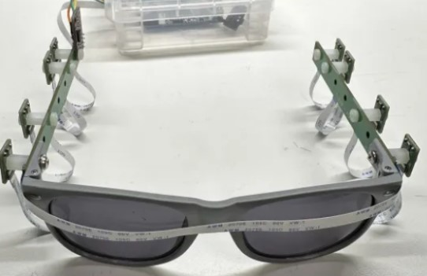
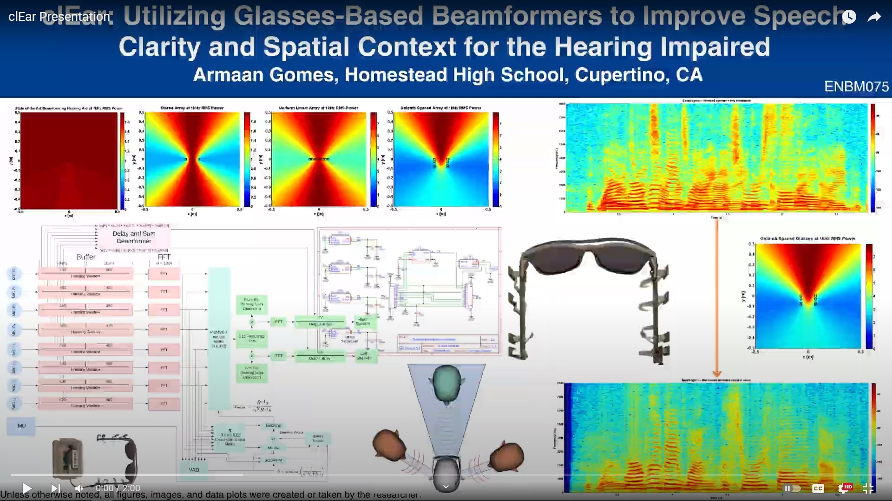

# clEar: Glasses-Based Beamforming Hearing Aids to improve Speech Clarity and Spatial Context

## Summary

Hearing loss is the fourth most prevalent disability worldwide, affecting one in five people, and is correlated with depression, isolation, and decreased life expectancy. Innovation in hearing aids over the last century has focused on miniaturization to overcome stigma. While successful, this focus has resulted in a form-factor with intrinsic physical limitations that hinder directionality and spatial context. Directionality is crucial to communication and social behavior in noisy environments. Hearing aids’ diminished directionality reduces speech clarity and spatial perception.

clEar, a beamforming hearing aid, unlike traditional designs, uses a glasses-based array of microphones to reduce unwanted noise and restore directionality for $200. clEar utilizes Golomb spacing to double audio bandwidth, a custom Multi Source Minimum Variance Distortionless Response (MSMVDR) beamforming technique to improve speech clarity while maintaining auditory transparency, and a hybrid multi-speaker tracking algorithm that integrates accelerometer data to compensate for head motion.

Evaluation using voices from the LibreSpeech audiobook recordings demonstrated a 71% increase in speech clarity as measured by Short Term Objective Intelligibility (STOI) and a 9.9 dB increase in Signal-to-Noise Ratio (SNR) after MSMVDR processing. The hybrid source tracking algorithm exhibited an average error of 3.8°, significantly outperforming the 58° error of a standard GCC based approach.

The novel array design enables efficient spatial processing and low power wearable implementation. clEar shows that glasses-based beamformers enhance speech clarity and spatial context in a socially-acceptable form-factor and have the potential to dramatically improve the lives of those with hearing loss.

# Images
### V4

### V3

### Presentation

## More Coming Soon ...

