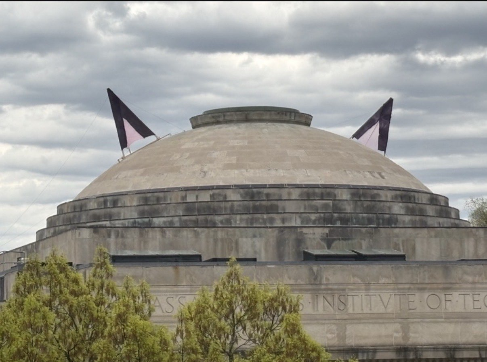

# Winning a CPU Optimization Challenge and Setting a new Class Record

<!--  -->
<BlogImage src="./blogs/c191w/image-2.png" caption="That Time When Hackers put Giant Cat Ears on the Little Dome (I lack a cover photo)" />

## The Challenge
Last semester, I took 6.191, Computational Structures, at MIT. 6.191 was a fascinating class. It covers everything from low level logic design of individual CMOS gates to adders, CPUs, and eventually operating systems and parallel processing. The TA's were great, the professors were awesome, and the content was super interesting. At the end of the class however, there is a final project. While the project specification document is 20 or so pages long, the gist is pretty simple: Build a RISC-V 32-bit processor that executes a specific program as fast as possible.

What is this program you ask? Well, it's performing inference on a neural network. Coincidentally, I had spent part of the semester [accelerating neural networks for fun](https://www.armaangomes.com/blogs/kernn/). To say I was well prepared was a bit of an understatement. 

As a bit of a disclaimer, in order to maintain academic honesty policies, I must be vague and cannot post any part of my code. However, I will mention general strategies that are either very obvious (like just mentioned in the challenge handout) or that will probably be banned next semester. Additionally, if any of the 6.191 course staff wishes for this to be taken down, please let me know. I do not intend to share anything I am not allowed to.

While we were free to do almost anything, there were pretty strict rules and constraints. First, memory latency is tied to your clock speed: faster clock equals higher throughput memory. This is due to simplifications in the simulation. Second, you aren't allowed to change the file that simulates your MainMemory because then you could just delete the latency and get infinite bandwidth. Additionally your output must be identical to the original. This means that you don't just have to get the correct answer, but also that your predicted likelihood for each possible answer must match the testbench. While these are just three of the constraints, they are the most important.

Now, on to breaking the record and confusing the TAs with a design so out there it forced the staff to change the rules.

## Part 1: The Base CPU

First I need a baseline to verify further optimizations. Scoring is tracked by the number of nanoseconds it takes your processor to run one inference from cold boot. It ranges from 20 million nanoseconds for 1 point to 250,000 nanoseconds for full credit. In an earlier 6.191 lab, you build a simple 4 stage CPU with dram access, cache, and support for RV32I. This CPU typically doesn't even meet the 20 million nanosecond benchmark.  

Now, neural network acceleration is heavily multiplier dependent so I first implemented 32-bit multiplications. This put me in the 10s of millions, but more importantly I could verify my future work would be correct by comparing my results at every step with my golden benchmark.

## Part 2: The Plan

I wanted to break the class record, which from what my seniors have told me is a bit over 54,000 nanoseconds. However, I did some quick math and realized that I would be incredibly bandwidth limited. I'd need to hit a clock speed of around 3.5 GHz in order to have any shot of beating it. More importantly however, I didn't just want to beat it I wanted to blow it out of the water. I wanted to target <25,000 nanoseconds. This would require a 6 GHz CPU, something that is practically impossible. So I looked for loopholes. I needed to increase memory bandwidth.

I read every file in the test harness and challenge repo. Eventually, I noticed something interesting. Every time you instantiated MainMemory, it was automatically preloaded with all of the program data, including all of the neural network weights. Furthermore, I noticed that every MainMemory has exactly 32 cycles of latency on a 16 word request. So naturally, I thought what if I make 32 copies of MainMemory and cycled between them, effectively multiplying my bandwidth by 32 times.

Surely,this would be against the rules? But, it wasn't. While modifying MainMem was illegal, there was nothing against making multiple copies of it. In fact, the default CPU uses two copies of MainMem, one for the instruction cache and one for the data cache. 

Now of course this means that I have to effectively find a way to process 64 weights every single cycle, load the activation quickly enough, deal with biases, misaligned memory, prefetching, requantization, edge effects on vector operations and many more issues (not to mention the 32 cycle memory delay). As much as I'd love to talk about that, as I personally feel that the tricks I had to pull to deal were pretty cool. I fear that would be too concrete and edge into academic integrity violations.

<BlogImage src="./blogs/c191w/image-1.png" caption="General Architecture Diagram: An accelerator bolted onto the standard CPU" />

## Part 3: The Implementation

So anyway, I implemented it. It was surprisingly straight forward once I ironed out the kinks. One key design choice however is that I decided to design all of this completely separate from the old 4 stage CPU. I just called one instruction and it ran the first layer of the neural network. Since the first layer accounts for over 90% of the computation, I focused on accelerating that before moving on to the rest. After I got it working, I saw a massive reduction in time: down to 700,000 nanoseconds. While that does seem large, it only took around 15,000 cycles to compute the entire top layer.

<BlogImage src="./blogs/c191w/image-3.png" caption="A single test synth." />

So naturally, I decided to submit my design to the online leaderboard and benchmark to verify that the loopholes worked online. But then, disaster struck. It passed the test cases, but when the server synthesized the design to analyze timing, it failed. After hours of debugging and testing, I began to realize that it might be that the design is so large that the server either crashes or runs out of time when synthesizing, causing the failure. So, I had to look for another solution.

## Part 4 : The Solution
I initially believed that MainMem was a no-synth component and thus be light on the synthesis load. However it actually used SRAM(cache) to store the data and only the latency generator was not being synthesized. This caused the server to synthesize massive amounts of cache and crash.

Then I had an idea, what if I just make my own SRAM and preload it with the data I need. So, I did. I analyzed the C binary for the program and found the weight matrices. I exported them into hex files and loaded them into a large SRAM. However, the default SRAM was 1 word wide, too slow for my throughput requirements.

By looking into how the HDL generated SRAMs I eventually found a way to generate high bandwidth memory. With this, I could have the same throughput raise without needing to duplicate MainMemory 32 times. Of course, this caused many other issues; most notably, shadow caches among other unique modules. I also had to check that the weight matrices did not change on the online grader, so I did that by modifying my baseline test results.

I submitted this new architecture to the grader and it passed. Now of course, it was far from the fastest design as it only accelerated the first layer, but it proved the idea worked.

## Part 5: Closing In
Shortly after, I accelerated the second layer. This brought my time down to the mid 70,000s. This put me on the podium of the leaderboard at the current time and was also when stuff started to go wrong. Shortly after posting the score, I got an email from my TA, who is by the way the best TA ever (and does super cool research). The email contained frowny faces telling me that it wasn't allowed. We talked for a bit after that and my TA asked me to come talk in-person with them about the design.  

We had a good talk and they came to realize that I wasn't cheesing the challenge, but had in fact built a relatively impressive accelerator even if it went against the spirit of the challenge. We also talked about their design (as it was currently on the top of the leaderboard). Additionally, I mentioned a few other loopholes that I chose not to exploit and will not disclose in this blog. 

In the end my TA suggested that I probably shouldn't put too much more work into it because they'd have to bring it up to the professors and see if it would be allowed to stand. So, I figured I'd accelerate the final layer then stop before pipelining to increase my clock speed.  

Eventually, I figured it all out and it got my score down to ~46,000 nanoseconds. Beating the class record and claiming the top spot.

<BlogImage src="./blogs/c191w/image.png" caption="The 6.191 Leaderboard Final Standings" />

## Part 6: The End

In the end my score stayed up. Admittedly, I didn't hit the sub 25k that I initially hoped for, but I also know it wasn't far out of reach. My CPU ran at around the speed of 1 GHz because I didn't spend any time on optimizing timing and pipelining. Most top CPUs ran at a bit over 3 GHz, and with proper pipelining, mine could have too. This would have brought it down to 15k nanoseconds. Furthermore, over 25,000 clock cycles took place before my first accelerator took place. If I managed to get this down, I might have even been able to get my time down into the 4 digits.

All in all, this project was objectively a waste of time, especially considering it was the week before finals. However, I had a ton of fun, learned a bunch of optimization techniques, got to talk about computer architecture with some cool people, and don't regret it for a second. While I did completely ignore the spirit of the challenge, I think it was a pretty cool problem. I have also received word that they are changing the rules and patching the loopholes I exploited. I am very grateful to everyone involved in 6.191 and thankful to all of them for running the class. 

Now if you would like to read about more traditional CPU designs (that are at actually practical), you should check out my friend [Liam Hanrahan's](https://www.outercloud.dev/) blog. He recently wrote a [post on our pipelined CPU design](https://www.outercloud.dev/blogs/riscv-2/). We are working towards out of order now along with efficient caching and DDR memory controllers with the ultimate goal of running DOOM.

