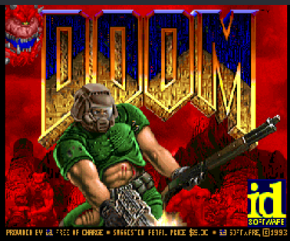
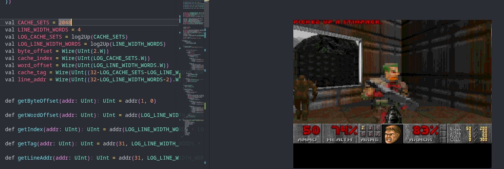

<BlogImage caption="DOOM">

</BlogImage>

# DOOM
Doom is a video game made by id Software that released in 1993. It was a revolution in gaming that spread across the world and defined the modern FPS. Its popularity has given rise to the saying "Doom can run on anything". To prove this point Doom has been ported to almost everything, from microcontrollers, to toasters, and even bacteria.

Two weeks ago we successfully ran(crawled) Doom on a CPU we built from scratch (and then posted a video that got a few million views). To be honest, I still can't believe it. What did we really do though? Well, we designed a custom CPU at the logic gate level, connected it to peripherals, adapted the DOOM source code to run on our machine, and deployed it onto an FPGA to run in real time. Before running Doom, we had only run simple programs that we had written, like Pong and Mandelbrot sets. Now we can run full published games, but getting here was a rather rocky road.

## The Requirements

Starting off with our pipelined design in this [post](https://www.outercloud.dev/blogs/riscv-2/), we set our sights on more complex programs. Pong was great, but it was from the 70s. We wanted to jump into the 90s. However, there were two big problems in our way: memory and speed. Larger programs need larger memory and our design could only utilize the FPGA's BRAM, which was less than a megabyte. The basic shareware for Doom (`doom1.wad`) is 14 megabytes. That doesn't even include the memory required to run the program, just to store it. The second barrier is speed. While Doom is a breeze for modern PCs, it's a slog for our CPU. We simply need to go faster.

Thus, Liam and I decided to pursue each problem individually. Liam is currently laying the groundwork for out-of-order processing which will enable far greater parallelism and pipeline fulfillment tricks. I took on memory integration. While it may sound simple: just hook up an extra memory chip, the reality is far more complicated.

## Memory Integration

In our original CPU design, memory was very clean. FPGA BRAM has 1 cycle latency and is very simple to interface with. This consistency meant that our pipelined processor never needed to stall for memory because the consistent delay was directly incorporated into our pipeline. Furthermore BRAM is granular, we can read and edit the memory word by word.  

DDR3 memory on the other hand is slow, has variable latency, and wide bus widths. This makes memory operations more complicated and less predictable. It also is a lot slower. If every memory operation was sent to the DDR3 memory, the CPU would slow to a crawl. This is where cache comes in. Programs don't use all of the memory at all times, so the cache stores active regions of memory in BRAM to increase access speed. A well optimized cache can almost eliminate the added latency due to DDR3.

## The Design

This version of the CPU uses a relatively standard 5 stage pipeline: Instruction Fetch, Decode, Register Read, Execute, Writeback. Furthermore, this design abstracts memory operations away into a unified interface to simplify the core pipeline stages.

### Core Pipeline

The instruction `Fetch` stage tracks the program pointer and fetches the correct instruction from memory via the instruction Cache (ICache). Unlike the previous design, it internally handles redirection and stalling. With the addition of DDR memory, redirection becomes far more complicated. Previously memory had one cycle latency, so you could fetch an instruction every cycle and switch the memory request address the cycle a redirection request comes in.

However, with the new design, if the fetch stage receives a redirection request, the memory might already have a request in flight. We now need to track that the next response from memory is invalid and then request the correct address. After resolving this issue the fetch stage works flawlessly.

The `Decode` stage is simple. It takes the 32-bit instruction, breaks it up into constituent parts and saves it to an instruction bundle that is sent forward through the pipeline. Now, there were some unique issues with this stage as well, but I'll save that for the later sections

The `Read` stage was significantly modified. One issue with our previous register file was that it used combinational reads that slowed down our CPU. This version pipelined reads, which adds a cycle of latency but shaves down the critical path delay. Another change was `Read-After-Write`(`RAW`) hazard handling. `RAW` hazards are where you read from a register before a pending write goes through, giving you incorrect data. The previous read stage internally tracked the last few register writes that had passed through it. This was logically efficient but fragile and didn't always work. More rigorous testing showed that special cases made it fail to detect hazards. The new version relies on a `Register Usage Map` (`RUM`) computed by the surrounding core and fed into the stage. The `RUM` is a 32-bit map that tracks if a register is in use or not. This naturally scales to variable pipeline lengths without requiring any magic numbers. Using the `RUM`, the Read stage decides if it must raise a hazard flag and stall the previous stages or let the instruction through. 

The `Execute` stage decides what to do with each instruction. It routes parts of the instruction to various components, calling the ALU for arithmetic, resolving branches, and talking to memory. When it resolves jumps, it sends a flush signal backwards through the pipeline to wipe incorrect stages. When it sees memory instructions, it drops into a specific memory wait stage that stalls until the memory responds.

The `Writeback` stage simply writes values back to the reg file.

### Memory Handling

The core pipeline is honestly pretty standard, the memory is where it gets juicy. In an ideally pipelined CPU, the instruction fetch stage fetches a new word and the execute fetches new data every cycle. For contrast the DDR3 on our FPGA can return 2 words every 30-60 cycles. This is significantly slower than our desired throughput, so we need a cache. Actually we need two caches. The fetch and execute stages might request two different addresses in one cycle, so to serve both of them we need an Instruction Cache (`ICache`) and Data Cache (`DCache`) that operate independently

#### Cache

The `ICache` and `DCache` are relatively simple and quite similar to each other. In fact, the `ICache` uses the exact same underlying code as the `DCache` but with the write logic stripped out. Both caches are  simple single way directly mapped caches. In the current iteration, they each use 2048 cache lines with 4 words each. 

When a memory request is received, the cache isolates the word address (by removing the two lowest bits) then computes the cache index. The cache index is the lowest 10 bits of the word address. It then pulls that cache line from BRAM. The cache line is composed of 3 components: data, tag, status. The data is the 4 actual words of memory that the cache is tracking. The tag is the upper bits of the word address and guards against cache aliasing. Aliasing is where multiple addresses point to the same cache index and we need to make sure that we do not confuse them. The 2 status bits represent valid and dirty signals. Valid means that the line data is actually data and not initialization randomness and the dirty signal lets us know if the CPU has modified the line since it was fetched from memory. If the pulled cache line is valid and has a matching tag, the cache performs a simple read or read-modify-write depending on the operation without ever making a memory request.

However, if the tag does not match, the cache must reference the DDR3 memory. There are two possible states of a valid cache line, clean and dirty. If a line is clean, we can just read the new cache line from the memory and discard the current data. If it is dirty, the cache must first writeback the modified line and then request the new data. Considering the DDR3 latency can be 30-100 cycles, while a cache hit is only 2 cycles, this is very slow. 

Frankly, this is an inefficient design. A better cache would use longer cache lines to improve storage density and spatial reuse, but the 4 word line width was chosen to simplify interfacing with the 128 wide MIG interface on the original FPGA board. Later we switched to a different board so its just left over inefficiency for now. 

#### Arbitration

Now, you might have noticed another issue. We used two caches to support two memory requests being in flight at the same time, but this just kicked the problem down the line. What if both the ICache and the DCache make a memory request at the same time. Back in [6.191](https://www.armaangomes.com/blogs/c191w/), this was resolved by having a memory chip per cache, but our board has only one chip so this is impossible. This is where the memory arbiter comes into play. It pretends to be a memory interface for both caches and typically just passes the request on to the actual DDR3 memory, but when a request is made when another is already in flight, it pretends as if the memory has received the requests but instead just queues it, waiting until the memory is free to send it through. Of course this presents the possibility of deadlocks where one cache starves the other of memory access. This is resolved by prioritizing the DCache over the ICache as it is further downstream in the pipeline and will eventually clear up and finish making memory requests.

#### The Low Level

With all of the above, the CPU works flawlessly with simulated memory, but it would not work in real hardware. First the DDR3 memory interface is quite complex and requires very tight timing and control. This is where Xilinx's Memory Interface Generator(MIG) comes in. It makes the ridiculously complex interface just a complex interface. The second problem is that the MIG runs on its own clock domain so if we were to directly connect the CPU to the MIG, it would run into indecipherable timing issues and crash. The third is that I couldn't get the MIG working on the original FPGA board working (the one with a 128 bit bus), so I borrow my friend [Ryan Tang](https://turtlely.github.io/)'s board which has a smaller DDR3 chip with a 64-bit bus. 

These problems were solved by a series of Clock Domain Crossings (CDCs), FIFOs, and protocol wrappers that are too painful to go into detail about, but can be found on Github. Most importantly though, it all works.

<BlogImage caption="With the new memory we can play the Bee Movie">
<video src="/IMG_9117.mov" controls style="width:60%;border-radius:8px;" />
</BlogImage>

### Interfacing and I/O

There are a few more things we need in hardware before we port DOOM though. The CPU works, but has no way to talk to the outside world. We need peripherals: Display Output, Hardware Timer, Debug Output, Keyboard Input. We decided to use Memory Mapped IO(MMIO) for these peripherals. The VGA Controller was already built, but I expanded it to 12 bit color and connected it to the HDMI port. The hardware timer was also simple. It just tracked time in microseconds and saved it to a word in memory. The debug output was slightly trickier. The simple version just hooks up a UART transmitter to a writable memory value. However, if the CPU printed many characters in a row, it would drop some and lead to garbage output. Thus I used a FIFO buffer to stop overflows. The Keyboard Input was worse. My original plan was to interface with the USB Host chip on the Urbana FPGA board that Ryan lent me. However, after writing the SPI driver was was confused to see nothing coming over the SPI bus. It seems like the USB port on the board does not provide power and thus could not power the keyboard. Instead, I wired up a UART receiver and forwarded keypresses from my laptop to the FPGA. It's not perfect, but it works. This rounded out everything we needed to run DOOM.

## Porting DOOM and Debugging

Porting DOOM to a new chip is challenging. You have to find a way to load the program, access the correct peripherals, get inputs in and out, and the usual jank fixes to deal with the platform quirks. Porting DOOM to a custom CPU is even more challenging because when it breaks you don't know if the code is wrong, or if your CPU is incorrect. On a positive note, Ozkl created [doomgeneric](https://github.com/ozkl/doomgeneric), which simplifies the porting process. Despite this simplification we encountered a number of challenges. My friend [Liam](https://outercloud.dev) took lead of the porting process and will probably give his insights on his blog. Among the many challenges, were file system issues, rendering challenges, and somehow so many issues with `printf` that he ended up writing his own version. The most curious issue was that sometimes `printf` works while in other cases it did not.

<BlogImage caption="The first time anything rendered">

</BlogImage>

Many of these bugs exposed CPU errors. For example, we frequently saw the system drop into an infinite loop that spanned hundreds of instructions and jumps. Other times it seemed to jump for random reasons and to places that made no sense. However, debugging the entire DOOM program at once was infeasible so we broke it down into parts, testing gradually more complicated programs. On occasion the cache arbiter and the MIG CDC would face an issue and drop a writeback request. Sometimes immediates would be calculated incorrectly, and in others the DCache would overwrite the instruction data. Some of these issues originated in our very first [single cycle processor](https://www.outercloud.dev/blogs/riscv-1/) and had just never been encountered until now. Eventually though, we got it all working in sim.

<BlogImage caption="DOOM Running in Simulation">

</BlogImage>

However, it just would not work in hardware. Any program we wrote worked, but DOOM simply wouldn't. It would seem to halt in random places, jump to random addresses, and somehow begin reading half-word instructions. This perplexed me for quite a while, it made no sense. It has to be an issue with the MIG simulation as that was the one part that could not be simulated easily, but every memory test I wrote worked perfectly in both simulation and hardware. After many hours being stumped I decided to change my simulation to initialize the DDR3 memory to random values before loading the program. This broke DOOM but no other program. It seemed that DOOM was assuming that uninitialized memory was zeroed out while in hardware it really wasn't. After a few linking and assembly fixes, DOOM finally loaded on the hardware. 

After that, it was relatively smooth sailing, and we got DOOM running at a nice round 0.7 FPS, it really should be seconds per frame. This was actually where I planned to end this blog: we accomplished what we set out to do. However I couldn't settle for 0.7 FPS. For example, I sat down to study linear algebra but instead began optimizing the CPU. I might be addicted. 

## The Road to 30 FPS

DOOM at 1 FPS is rather lackluster. Impressive for sure, but not playable. We wanted to play DOOM not just watch a slideshow. The easiest speed up is to simply bump the clock speed. Raising it from `100MHz` to `125MHz` gave around 20% higher FPS. This isn't exactly 25% because the memory latency is decoupled from the CPU core speed. The next optimization was in the fetch stage of the CPU. The original fetch design was super inefficient and focussed more on correctness rather than speed. Due to this, it would frequently make 2 requests to the ICache per instruction. Fixing this got us to around 2.5 FPS, over 300% faster. 

At this point though, improving performance became slightly more challenging. I turned to adding more instructions. I implemented multiplication operators, but chose to not implement division or modulo. This was because that would increase pipeline complexity. Thus, the CPU became a `RV32I-ZMMUL` CPU. This net us another FPS, bringing us to 3.5 FPS. Considering our goal of 15 FPS, this was rather disappointing but still a step in the right direction.

After that, I took a closer look at what functions were using CPU time and realized that copying data from the screen buffer into the vga controller bram was costly. It stressed our memory bandwidth and flushed our cache. Thus I modified the code to write directly into the VGA bram. In tandem I realized that I could pipeline cache read hits in order to drop latency from 2 cycles to 1 cycle. The combination of these brought us to around 6.7 FPS.

From here it didn't look like there were many easy ways to improve speed without massively changing the pipeline. Considering that we are currently working on an out-of-order pipeline that will overwrite most of our current pipeline, we didn't want to invest too much time into this pipeline. There was however, one lever we could still pull: compiler optimization. The version of DOOM we were currently running was compiled with `O0`. This means that the compiler would not try to optimize our code at all. This should be a simple change, just change the 0 to a 2 and everything should work. However, every time we tried that, it crashed and we couldn't figure out why. Initially we thought that it was an error in the CPU. Why would compiler optimization break our code? After many hours of debugging though, we pin pointed the issue. We didn't mark the hardware timer `MMIO` pointer as `volatile`. The compiler would see that we never write to the timer and thus optimized it out of the code. I found [this blog post](https://barish.me/blog/cpp-o3-slower/) helpful when learning about optimization After fixing this issue, the game ran flawlessly.

<BlogImage caption="DOOOOOOOOOOOOOOOOOOOOOOOOOOOOOOOOM!!!!!!!!!">
<video src="/IMG_9579.mov" controls style="width:60%;border-radius:8px;" />
</BlogImage>

So, how far did we get? After compiler optimization, DOOM ran smoothly at 15-20 FPS and is now very playable and quite fun. I see why it was so popular back in the day. With out of order processing and other optimizations we hope to eventually reach 30 FPS.

## AI Usage

As always, nothing on this blog post was written by AI. It would be rather pointless to share the thoughts of a machine on my blog. As far as the code, AI was primarilly used for debugging, writing tests, and helper scripts. LLMs are very good at writing tests as they can procedurally generate hundreds of potential failure points in a few minutes. This helped in tracking down the needle in a haystack bugs that we found in DOOM. I've also found it pretty useful to write helper scripts, like python uart parsers because I could write them on my own, but its just faster to do it with AI. As for the actual Chisel, almost all of it was written by hand. In some cases I asked AI to help with refactoring from my previous code (some of which was in BlueSpec, Verilog, or other Chisel modules) because I was feeling lazy. In my previous experience, LLMs weren't very good at just writing modules from scratch. They frequently made questionable design decisions and required me to hold their hand in anything complex. Also it kind of removes the joy from building stuff like this if its all AI. As for the website, its a fork of my friend Liam's website with AI to help style it (because I hate CSS with a burning passion).

## In Closing

Porting DOOM was a fun experience, albeit slightly traumatic. I learned a ton about memory and cache, but I think learning how to debug systems this large was the biggest benefit. On a slightly hilarious note, I posted a [9 second video](https://www.instagram.com/armaan.gomes/reel/DatqWKChtnw/?hl=en) of it running, and it is currently sitting at 2 million views, which is crazy. As for future plans, we are currently working on implementing out-of-order processing as well as better memory access patterns. This should make it run a lot faster. Perhaps after that and after we write a basic GPU we could port Quake 2. Hopefully soon we can also run on a larger FPGA as well (foreshadowing). 

Thanks for reading and please reach out if you have any questions! 

