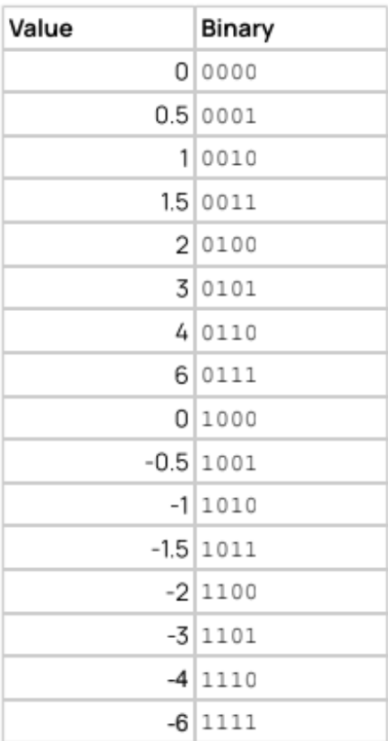

# Building an Optimized FP4 multiplier

So a few months ago, Etched, a transformer ASIC company, came to campus and gave a talk. In that talk they proposed a challenge: build the smallest FP4 multiplier possible. Now I disregarded this challenge for quite a while because gate level optimization didn't sound all that fun at the time. Then, one fateful night, around 3 am, I got bored

## The Problem:

<figure style="float:right; margin: 0.25rem 0 1.5rem 2rem; max-width: 11rem; text-align: center;">
  
  <figcaption style="font-size: 0.62rem; letter-spacing: 0.08em; text-transform: uppercase; opacity: 0.45; margin-top: 0.45rem; font-family: 'DM Mono', monospace;">FP4 E2M1 encoding</figcaption>
</figure>

Note: I am uncertain if I am allowed to disclose this, but the challenge problem document had no access controls, so I assume it is fine to share some details. If Etched wants this taken down, please contact me.

The problem states that Etched is implementing MxFP4 multiplication in their next generation ASIC, and are trying to minimize the size of their FP4 multipliers. For simplifying post-multiplication calculations, the multiplier must take in FP4 in E2M1 format and output what they call: QI9 (nine bit twos'complement where the LSB represents 1/4).

You are only allowed to use 'AND', 'OR' and 'NOT' gates and the goal is to minimize the total gate count.

There is one other lever however: you can remap the inputs to further decrease hthe size. However the remapping must be symmetrical. In `a*b=c` the bit representation of a and b must be the same if the numerical value is the same.

<div style="clear:both"></div>

## Why does this matter:

AI. Recently, people realized that you can quantize large language models down to FP4, 4-bit floats, without too much accuracy loss. Even more so they realized that by exploiting spatial similarity in weights we can even almost entirely mitigate the accuracy loss of quantization. Now, the biggest benefit of smaller weights is that it means you need less memory to store the model and less bandwith as well. In short, if you are willing to cope with the accuracy loss, quantization provides massive benefits. 

Here is an interactive multiplier example:
<FP4Widget />

I did find it interesting however that Etched wants the smallest possible multiplier without any regard for other constraints like timing or power. Also the restriction to just 'AND', 'OR', and 'NOT' gates was surprising as it opposes the inverting nature of CMOS, where 'NAND' gates are smaller and faster than 'AND' gate. While I presume the gate restriction is in order to simplify the problem, I believe that the lack of timing constraints is due to the fact that there will almost certainly be another part of the chip, a higher level component with a longer combinational path and thus the timing of this component is irrelevant. 

On a side note, I also initially wondered why they cared so much about the size of the FP4 multipliers when the problem is primarily bandiwidth limited, so squeezing more multipliers onto the same chip would not lead to performance uplifts. However, I eventually realized that if they shink the arithmetic units, they can save more room on the die for cache, increasing weight reuse and decreasing bandwith pressure. 


## My Designs

So I got my design down to 78 gates. Etched claims to have an optimal design but does not disclose its size. It just claims that is is smaller than what AIs can do. I asked Claude Opus the same question and after a lot of prompting it got down to ~84. However, while I beat the AI, I do not believe that I have the best solution (more on that later).

If I'm going to be honest, the final verilog is pretty hard to read, and I believe the process of coming up with it is more interesting than the final code itself, though it has been attached to the bottom of the blog. 

This design does not remap the inputs. A and B are encoded in E2M1: Sign,Exponent 1,Exponent 0, Mantissa. To get my solution, I wrote down the boolean equations concerning each bit and hand-optimized them on paper until I got as far as I possibly could with a little abstraction(higer level gates, barrel shifts, negation). However, when I translated this to Verilog, it was around 120 gates after I ran synthesis with yosys and the ABC optimizer. 

So I began expanding my abstractions (such as barrel shifting and negation) in order to squeeze down the gates by cutting down logic. However, eventually I began fighting the optimizer as it balances between area and timing, so I eventually switched to the "simple" optimizer that just converts the verilog to a netlist without many changes. Among these changes are a number of timing sacrifices for a few gates. For example, the negation at the end relies on a massive prefix chain. After much work, I got down to 78 gates.

Looking back on the design, its possible that if I expand the XOR instead of letting the synthesizer sort it out, it might have slightly fewer gates. Perhaps I'll try that next.


## Remapping

I believe that my design is not optimal. If I could find a way to remap the inputs in such a way that eliminates the need for two's complement negation or the barrel shift, I could significantly cut down on the size. This is also cemented by the foot note of the Etched challenge document stating that the optimal solution requires remapping. 

I tried a number of possibilities, from fixed point, to ternary, and even logrithmic representations, but nothing seemed to work. Eventually I decided to brute force it. I made a program that generated random remappings and fed the look up table into the synthesizer, hoping that one would result in a sudden drop in gate count. However, this did not work either. I began brainstorming other alternatives, but sadly had to focus on finals. One day, I hope to get back to this and try finding the optimal remapping.


## Conclusion

In the end, it was a fun journey. I had fun optimizing the design and working away the gates. I am a bit dissapointed that I haven't found the optimal design, but I have many more optimization ideas that I want to pursue. Hopefully those, will lead to better results. I did try to contact our Etched recruiters to ask how my design shaped up, but recieved no response. On that note, I have a question for the reader; the same question I face: How far can you optimize an FP4 multiplier? If you have any ideas, contact me and I'd love to hear them.

<AMA />


## Verilog
```
module fp4_mul_x4_v2 (
    input  wire [3:0] a,
    input  wire [3:0] b,
    output wire signed [8:0] result
);
    wire s_a = a[3];
    wire s_b = b[3];
    wire s_out = s_a ^ s_b;

    wire m1 = a[0];
    wire m2 = b[0];   
    wire c = a[2] | a[1];
    wire d = b[2] | b[1];
    wire cm2 = c & m2;
    wire dm1 = d & m1;
    wire cd  = c & d;
    wire p2carry = cm2 & dm1;

    
    wire p0 = m1 & m2;
    wire p3 = cd & p0;
    wire p2 = cd ^ p3;

    wire [3:0] m = {p3, p2, cm2 ^ dm1, p0};

    wire a_upper = a[2] & a[1];
    wire b_upper = b[2] & b[1];

    wire [1:0] a_opt = {a_upper, a[2] ^ a_upper};
    wire [1:0] b_opt = {b_upper, b[2] ^ b_upper};

    wire et0 = a_opt[0] ^ b_opt[0];
    wire ec0 = a_opt[0] & b_opt[0];
    wire et1 = a_opt[1] ^ b_opt[1];
    wire ec1 = a_opt[1] & b_opt[1];
    wire [2:0] e     = {ec1,(et1) ^ (ec0),et0};


    wire e4 = (ec1);
    wire e3 = (et1 & et0);
    wire e2 = e3 ^ e[1];
    wire e1 = e[0] ^ e3;
    wire e0 = ~(a[2] | b[2]);


wire [8:0] mag;
assign mag[0] = e0 & m[0];
assign mag[1] = (e0 & m[1]) | (e1 & m[0]);
assign mag[2] = (e0 & m[2]) | (e1 & m[1]) | (e2 & m[0]);
assign mag[3] = (e0 & m[3]) | (e1 & m[2]) | (e2 & m[1]) | (e3 & m[0]);
assign mag[4] =                (e1 & m[3]) | (e2 & m[2]) | (e3 & m[1]) | (e4 & m[0]);
assign mag[5] =                               (e2 & m[3]) | (e3 & m[2]) | (e4 & m[1]);
assign mag[6] =                                              (e3 & m[3]) | (e4 & m[2]);
assign mag[7] =                                                             (e4 & m[3]);
assign mag[8] = 0; 
    
wire [8:1] any_lower;
assign any_lower[1] = mag[0];
assign any_lower[2] = any_lower[1] | mag[1];
assign any_lower[3] = any_lower[2] | mag[2];
assign any_lower[4] = any_lower[3] | mag[3];
assign any_lower[5] = any_lower[4] | mag[4];
assign any_lower[6] = any_lower[5] | mag[5];
assign any_lower[7] = any_lower[6] | mag[6];
assign any_lower[8] = any_lower[7] | mag[7];


assign result[0] = mag[0];                               
assign result[1] = mag[1] ^ (s_out & any_lower[1]);
assign result[2] = mag[2] ^ (s_out & any_lower[2]);
assign result[3] = mag[3] ^ (s_out & any_lower[3]);
assign result[4] = mag[4] ^ (s_out & any_lower[4]);
assign result[5] = mag[5] ^ (s_out & any_lower[5]);
assign result[6] = mag[6] ^ (s_out & any_lower[6]);
assign result[7] = mag[7] ^ (s_out & any_lower[7]);

assign result[8] = s_out & any_lower[8];
endmodule
```

