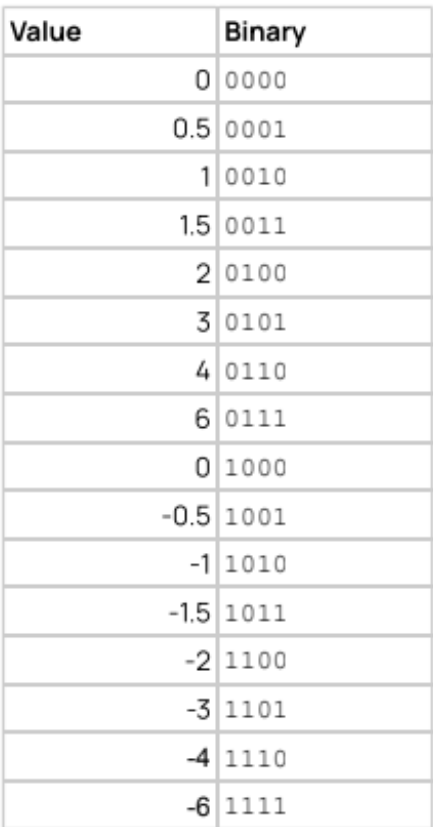

So a few months ago, Etched, a transformer ASIC company, came to campus and gave a talk. In that talk they proposed a challenge: build the smallest FP4 multiplier possible. I disregarded this for a while because gate level optimization didn't sound all that fun. Then, one fateful night around 3am, I got bored.

## The Problem

<!--  -->

The problem states that Etched is implementing MxFP4 multiplication in their next generation ASIC and are trying to minimize the size of their FP4 multipliers. The multiplier must take in FP4 in E2M1 format and output QI9 (nine bit two's complement where the LSB represents 1/4). You are only allowed to use AND, OR and NOT gates. The goal is to minimize total gate count.

There is one other lever: you can remap the inputs to further decrease the size, but the remapping must be symmetrical — in `a*b=c` the bit representation of a and b must be the same if the numerical value is the same.

## Why It Matters

Recently, people realized you can quantize large language models down to FP4 without too much accuracy loss. By exploiting spatial similarity in weights you can almost entirely mitigate the accuracy loss of quantization. Smaller weights means less memory and less bandwidth. 

I found it interesting that Etched wants the smallest possible multiplier without regard for timing or power. The gate restriction to AND/OR/NOT opposes the inverting nature of CMOS, where NAND gates are smaller and faster. I believe the lack of timing constraints is because there will almost certainly be another part of the chip with a longer combinational path, making the timing of this component irrelevant. If they shrink the arithmetic units, they can save die area for cache, increasing weight reuse and decreasing bandwidth pressure.

## My Designs

I got my design down to 78 gates. Etched claims to have an optimal design but does not disclose its size — it just claims to be smaller than what AIs can do. I asked Claude Opus the same question and after a lot of prompting it got to ~84. I beat the AI, but I don't believe I have the best solution.

The final Verilog is pretty hard to read. I wrote down the boolean equations for each bit and hand-optimized them on paper until I got as far as I could. When I translated this to Verilog it was around 120 gates after synthesis with Yosys and the ABC optimizer. I began expanding my abstractions to cut down logic, eventually switching to the "simple" optimizer that just converts Verilog to a netlist without many changes. After many timing sacrifices — for example, the negation at the end relies on a massive prefix chain — I got down to 78 gates.

## Remapping

I believe my design is not optimal. If I could find a remapping that eliminates the need for two's complement negation or the barrel shift, I could significantly cut down on size. This is cemented by the Etched challenge document stating that the optimal solution requires remapping.

I tried fixed point, ternary, and logarithmic representations, but nothing worked. I brute-forced random remappings through the synthesizer hoping for a sudden drop in gate count. It didn't work. I had to focus on finals. One day I hope to return to this.

## Conclusion

It was a fun journey. I'm disappointed I haven't found the optimal design, but I have more optimization ideas to pursue. I tried contacting our Etched recruiters to ask how my design shaped up and received no response. I have one question for the reader: how far can you optimize an FP4 multiplier?

<AMA />

## Verilog

```verilog
module fp4_mul_x4_v2 (
    input  wire [3:0] a,
    input  wire [3:0] b,
    output wire signed [8:0] result
);
    wire s_a = a[3];
    wire s_b = b[3];
    wire s_out = s_a ^ s_b;

    wire m1 = a[0];
    wire m2 = b[0];
    wire c = a[2] | a[1];
    wire d = b[2] | b[1];
    wire cm2 = c & m2;
    wire dm1 = d & m1;
    wire cd  = c & d;
    wire p2carry = cm2 & dm1;

    wire p0 = m1 & m2;
    wire p3 = cd & p0;
    wire p2 = cd ^ p3;

    wire [3:0] m = {p3, p2, cm2 ^ dm1, p0};

    wire a_upper = a[2] & a[1];
    wire b_upper = b[2] & b[1];

    wire [1:0] a_opt = {a_upper, a[2] ^ a_upper};
    wire [1:0] b_opt = {b_upper, b[2] ^ b_upper};

    wire et0 = a_opt[0] ^ b_opt[0];
    wire ec0 = a_opt[0] & b_opt[0];
    wire et1 = a_opt[1] ^ b_opt[1];
    wire ec1 = a_opt[1] & b_opt[1];
    wire [2:0] e = {ec1, et1 ^ ec0, et0};

    wire e4 = ec1;
    wire e3 = et1 & et0;
    wire e2 = e3 ^ e[1];
    wire e1 = e[0] ^ e3;
    wire e0 = ~(a[2] | b[2]);

    wire [8:0] mag;
    assign mag[0] = e0 & m[0];
    assign mag[1] = (e0 & m[1]) | (e1 & m[0]);
    assign mag[2] = (e0 & m[2]) | (e1 & m[1]) | (e2 & m[0]);
    assign mag[3] = (e0 & m[3]) | (e1 & m[2]) | (e2 & m[1]) | (e3 & m[0]);
    assign mag[4] =                (e1 & m[3]) | (e2 & m[2]) | (e3 & m[1]) | (e4 & m[0]);
    assign mag[5] =                               (e2 & m[3]) | (e3 & m[2]) | (e4 & m[1]);
    assign mag[6] =                                              (e3 & m[3]) | (e4 & m[2]);
    assign mag[7] =                                                             (e4 & m[3]);
    assign mag[8] = 0;

    wire [8:1] any_lower;
    assign any_lower[1] = mag[0];
    assign any_lower[2] = any_lower[1] | mag[1];
    assign any_lower[3] = any_lower[2] | mag[2];
    assign any_lower[4] = any_lower[3] | mag[3];
    assign any_lower[5] = any_lower[4] | mag[4];
    assign any_lower[6] = any_lower[5] | mag[5];
    assign any_lower[7] = any_lower[6] | mag[6];
    assign any_lower[8] = any_lower[7] | mag[7];

    assign result[0] = mag[0];
    assign result[1] = mag[1] ^ (s_out & any_lower[1]);
    assign result[2] = mag[2] ^ (s_out & any_lower[2]);
    assign result[3] = mag[3] ^ (s_out & any_lower[3]);
    assign result[4] = mag[4] ^ (s_out & any_lower[4]);
    assign result[5] = mag[5] ^ (s_out & any_lower[5]);
    assign result[6] = mag[6] ^ (s_out & any_lower[6]);
    assign result[7] = mag[7] ^ (s_out & any_lower[7]);
    assign result[8] = s_out & any_lower[8];
endmodule
```
