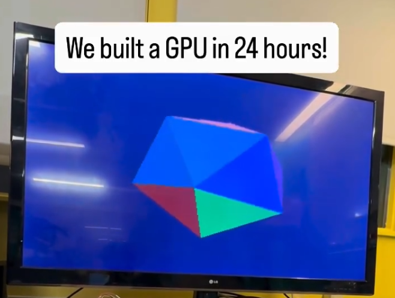
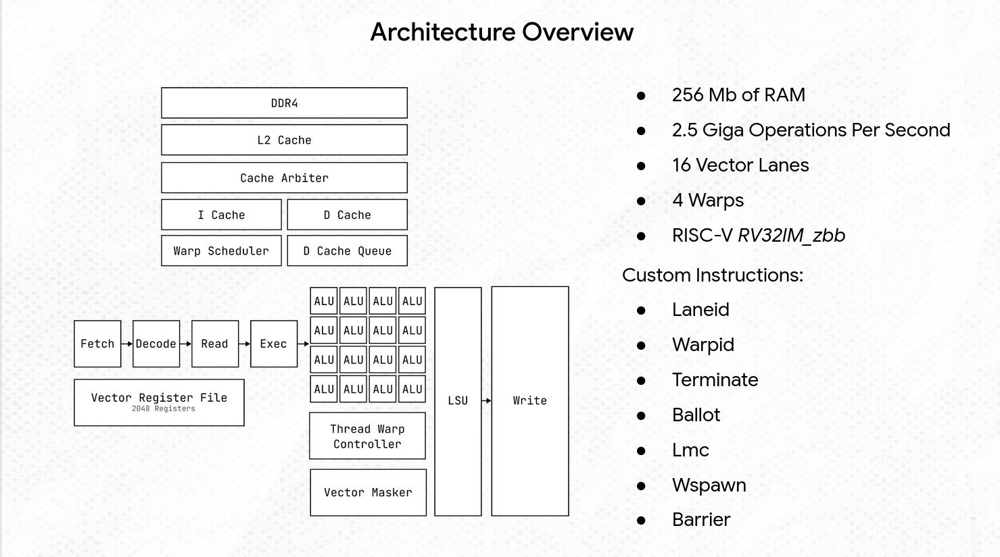
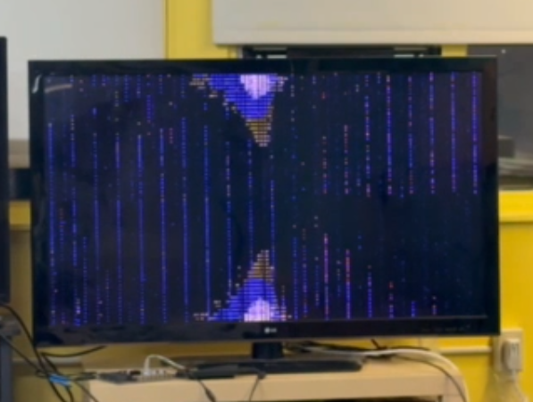
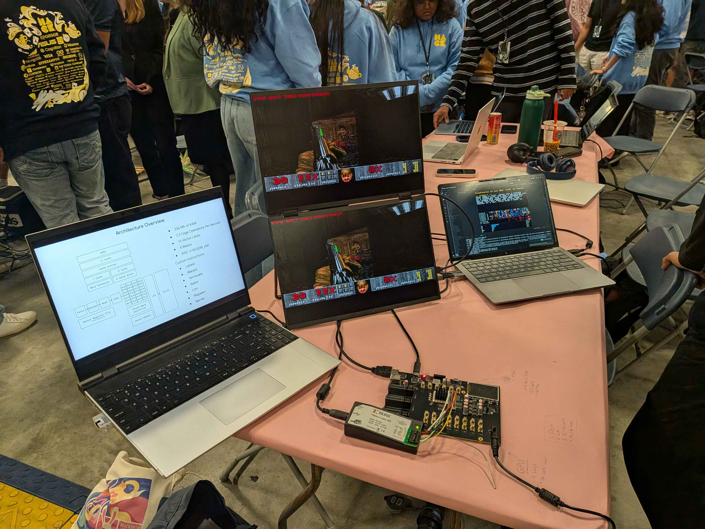
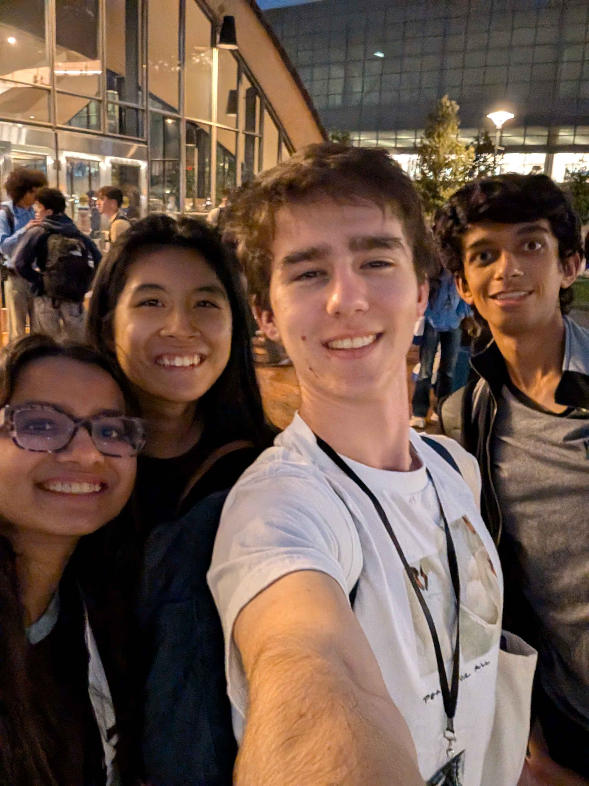

## Pulling the Impossible

If I'm being honest, I still can't believe we managed to pull it off. Over the course of 24 hours, we built a GPU, made kernels for it, and were able to demo it live, eventually winning second place at HackMIT. 

One might say, how is this possible? It takes AMD and NVIDIA at least a year to build a new GPU. Well, you see, we made an incredibly simple GPU, essentially an MVP GPU. It also helps that we spend most of our waking hours working on chips and had the objectively best team: Liam Hanrahan, Yolanda Hu, Kshemaahna Nagi, and me. Additionally, we had the power of "**Pure Protein Chocolate Peanut Butter Bars**" by our side. This is not a paid sponsorship. I think I ate 5 over a 24 hour period. I only stopped because I ran out.

Before I go too deep, you should know that Liam also wrote a post on our GPU, which can be found [here](https://www.outercloud.dev/blogs/gpu/). I plan to go a bit deeper into the architecture and the process of building it, and hope that this post reflects what little of my sanity was left at the end of the hackathon.

## Pre Game

Why build a GPU? Well, Liam and I were sitting at a table and talking about how we didn't want to vibecoding for hours on end. It just didn't feel fulfilling. So we thought "what's the most ridiculous thing our team would be uniquely good at building. Over the summer, Liam and I had always discussed plans to build a GPU at some point. However, we could never find time. Naturally, we put two and two together and wondered, what if we built a GPU in 24 hours? We pitched the idea to our team and decided to pursue it. 

Frankly, I worried it couldn't be done. In all of the iterations of our CPU and all my personal projects, we've never been able to go from 0-1 that fast. Naturally, this just meant we had to plan really really well.

Before the hack, we made a plan. We drew out the architecture on our lounge whiteboard and assigned rough roles. Liam and I would work on the RTL for the GPU itself while Yolanda and Kshemaahna would write kernels to run on our GPU. Sadly, the original diagram has been lost to time (we erased our whiteboard). 

Our plan for the GPU was to build it in 4 parts. First, start off with a simple RV32 pipelined core. Second, vectorize it to make it into a `SIMD` (Single Instruction Multiple Data) machine. Third, add hardware multithreading (called warps in NVIDIA GPUs and waves in AMD). Fourth, build kernels and implement multicore cache coherence.

## The Start

The day of the hackathon started off with a "**Pure Protein Chocolate Peanut Butter Bar**". The dining hall wasn't open and I was hungry. The opening ceremony was great and I loved 3blue1brown's speech. After that it was hacking time!

We naturally started hacking by getting lunch. Food is very important. After lunch, we got to work. Liam decided to take up adding warps to our design while I took on vectorizing our design. Kshemaahna decided to make an LLM run on our GPU while Yolanda took on a physics sim. 

One problem was that we didn't have enough time to implement warps and vectorization sequentially, so we had to make them on separate branches and merge them later. (Insert subtle foreshadowing about a merge conflict from hell here)

## Vectorization

### V1
How do you turn a CPU that executes one instruction on one piece of data every cycle into one that executes one instruction on `n` pieces of data at once? The solution is copy-paste. Yes, just take the pipeline and duplicate it `n` times. The first vectorized version read the instruction and decoded it like normal. Then, it split into 16 register files, 16 ALUs, and a 16-wide writeback stage. This works for most problems, but has an issue with memory. We didn't have 16 DDR4 chips, so we could only make one memory request a cycle. This was resolved by only accepting the memory request from the first lane. 

If something seems off to you, you're right. While this version is vectorized and runs 16 computations at once, it does the same 16 computations at once every single time. So, it's pretty worthless. However, it is technically correct and we were able to run mandelbrot at the exact same speed a single-lane CPU would have. We could even run DOOM. 

### V2
So how do you make vectorization useful? The best way would be to run a different program on every lane. However, this is just a bad multicore CPU (or if done well a good SIMT machine). What we need is a way for each lane to run the same instruction on a unique piece of data. This required our first custom instruction `laneid rd`. It simply writes the lane id to the target register. This can be used like so:

```c
data = arr[offset + laneid()];
```

This lets each lane do unique work but also introduces a few unique problems:
1. Our memory system is now broken; it can't accept 16 requests at once
2. What happens when lanes take different branches?

If you remember from the [previous blog](https://armaangomes.com/blogs/techooo/), the last memory system I wrote was a non-blocking data cache. This lets us continue executing instructions while the memory is returning the correct value. If I'm being honest, this was written in an incredibly poor way and was very fragile. The core fragility was that most memory ops would have >=1 cycle latency while MMIO reads were combinational. Naturally, this relied on a very jank handshake bypass signal. If this sounds like really bad design, it is. It's awful. 

After fixing all of those, and making all memory operations non-blocking and decoupled, I then implemented a simple state machine in our execute stage to stall and serialize the memory requests. This was again a bad decision, but wasn't a problem for now. (More foreshadowing)

As for branching, I had a very simple solution: force all lanes to take the same branch. What this really means is that if you ever had a branch that depended on per-lane data, the GPU would explode. This might sound incredibly stupid, but with enough compiler torture you can write GPU accelerated kernels that don't branch. 

This led to our first actual GPU accelerated kernel: mandelbrot. However, now instead of doing 1 pixel 16 times, we could do 16 pixels at once. This led to an almost **16x bump in performance**. However, due to memory serialization and the lack of branches, some performance was lost.

### V3 Branches and BS

Now, how do we branch without exploding? Masks. The pattern is simple. When the programmer wants to branch, perform the following steps:
1. Compute the condition for every branch
2. Determine which lanes have a true/false condition
3. Mask out the branches that don't take the branch
4. Run true branch
5. Flip mask
6. Run false branch
7. Disable mask

Once again this seems convoluted and painful. It is; ideally we could handle branch divergence in hardware, but there was not enough time to implement that. How does this work in hardware? First, I added a lane mask controller (`LMC`). This is used as a stamp on each instruction that can toggle on/off ALUs, memory operations, and register writeback on a per-lane basis. It's stored as an `n`-bit register. 

This necessitates a few extra instructions. We first need an instruction to set the `LMC` (`lmc`) so the program can turn specific lanes on and off. Then we need a way to compare boolean conditions across lanes. I took inspiration from the Vortex GPU for this and implemented a `ballot` instruction. `ballot` checks if a given register is 0 for every lane and loads its result into the target register. 

This lets us translate:

```c
if (a == b) {
  do(c);
} else {
  do(d);
}
```

into:

```c
e = ballot(a == b)
lmc(e)
do(c)
lmc(~e)
do(d)
```

While this is annoying, it lets us handle branching with only slight nonsense. Note that this paradigm allows normal branching provided the branches don't deal with lane-specific data. 

## Warps

While I was working on vectorization, Liam worked on warps. The core goal of warp scheduling is to leverage thread level parallelism during long stall periods. For example, when running DOOM, our average memory access time (`AMAT`) is between 5 and 9 cycles. When we vectorize our processor and run 16 memory operations in series, that's almost 128 cycles of waiting while doing nothing. This is further exacerbated when we can have up to 64 memory operations in flight at once. 

The GPU can maintain up to 4 simultaneous warps. A warp contains all of the execution context required for 1 thread (later expanded to 16 with vectorization). When a warp is running and is forced to stall on a memory load, it instead swaps to the next warp. This requires us to flush the core, which costs ~5 cycles. If we swap on every single memory operation this is inefficient, but as we vectorize, the benefits grow. 

When managing warps, we could use the `warpid` and `terminate` instructions to manage dataflow.
```c
data = arr[offset + warpid()];
```


To manage and maintain warps, we used a separate 32-register file for each hardware warp. We also implemented subsystems to define more than 4 warps in software, a `warpid` instruction (just like the `laneid` instruction), and a way to terminate and launch new warps as hardware warp slots freed up. Once we merged warps and vectorization, they would let us define kernels in the same block/thread format as CUDA. There was initially a problem where terminating a warp did not wipe the register file, meaning that the next warp would init with malformed registers. This was solved in software by clobbering the reg file before terminating.


## The Merge Conflict from Hell

Once Liam and I had developed each of these features, we had to merge them. This was a slight nightmare. Most files were relatively straightforward, though some, like Execute.scala, had misaligned changes which made sewing it back together take a while. All in all, the merge took 2 hours. 

However, that didn't mean everything worked now. We had changes that didn't conflict in terms of lines of code but instead in intent. For example, serializing the memory for vectorization blocked the execute. However, in the warp branch, the hardware multithreading relied on non-blocking memory to switch threads. This required a dedicated Asynchronous Load Store Unit. This unit takes the parallel memory load and asynchronously serializes it, freeing up the execute to run another thread. 

The register file also needed some changes. In the original core, it was a simple combinational register file with a massive mux between registers. This was fine with a 32-register file. Now we have 2048 registers. This would require 65k muxes for each read port, which is a bit ridiculous. Instead, I modified the register file to use SyncReadMem. This introduces new challenges. The standard reg file has 2 read ports and 2 write ports (the second write is for async memory writes). But with SyncReadMem, going over 2 ports is a bad idea. 

This was a rather confusing problem for my brain at 3 am. Eventually, I realized I could use the power of metadata to save the day. The strategy revolves around having 2 banks, each 2048 registers large. Then, on writes, the register file tracks where the latest write to each register in the bank is. Then, on a read you can read from the bank with the latest value. This is called an `LVT` (Live Value Table). This should be able to run with just 2 ports per bank if muxed correctly. I actually did it slightly incorrectly so it synthesized as LUTRAM instead of BRAM, which is unfortunate, but it still ran, so all's well that ends well.


In this integration process, I added two more instructions, warp spawn (`wspawn`) and barrier (`bar`). The former is used to dynamically allocate warps and spawn new ones on command while the latter is for cross-warp synchronization. It forces warps to wait until every other warp has also reached the barrier. This is useful for framesync and stops tearing. 

From what I recall, these were the biggest changes with the merge, though the longer the night drew on the less I remember. Also at this point I was on my fourth "**Pure Protein Chocolate Peanut Butter Bar**". It was also 4 am.

<BlogImage caption="Architecture Diagram">


</BlogImage>

## The GPU Runs

At this point, I needed to get it running on the FPGA. Unfortunately, every Vivado synthesis took 30 minutes, so debugging the scaffold took quite a while. In the meantime, I pointed Claude at our simulation and set up a small environment for it to build and test kernels. As much as we would have loved to write all the kernels ourselves, we simply didn't have the time. Eventually we got it running on our massive TV with only a few timing violations and were able to run a full mandelbrot kernel with 64 concurrent threads.

<BlogImage caption="Timing Violations Led To Unique Images">


</BlogImage>
 

While all of this was running, Claude was used to generate some simple 3D rendering, fluid simulation, and physics simulation demos. Again, it was like 5 am. Liam was also working on writing kernels at the same time. Once we got the demos working, I had my fifth and final "**Pure Protein Chocolate Peanut Butter Bar**" at this point. It was also 8 am so we rushed off to the venue.


## Judging

While we were waiting for judging to start, we updated the plume, made a simple set of slides, and set up the demo. During this time we also fixed a few bugs in the register file and worked to integrate Kshemaahna's LLM code and run DOOM. You might wonder, how do you run a game intended to run on a single thread on a CPU on a 64-thread GPU? Well, we just turned 63 threads off. Yes, this is goofy, but we simply didn't have time to make it work better (it was already hitting 20-30 fps). On a positive note, we got DOOM running, and then proceeded to work on adding the LLM Demo. This was honestly my favorite demo and Kshemaahna did some insane work on it.

<BlogImage caption="DOOM Running on the GPU at Judging">
<video src="/IMG_9993.mov" controls style="width:60%;border-radius:8px;" />
</BlogImage>


Eventually we spoke to judges and a bunch of our fellow competitors. It was awesome meeting all the amazing people at HackMIT and we had a ton of fun. At the end, we were invited to panel judging for a second round. Around 4, we headed up to the panel and presented our GPU. It was pretty terrifying, especially considering that we were given 7 minutes to present without any setup time. Thus, I spent most of the presentation fumbling while trying to speed run setting up the FPGA and flashing it (programming the FPGA and flashing DOOM takes 2 minutes). In the end, though, we gave a good presentation and headed back down to wait for the awards ceremony. 

<BlogRow>
<BlogImage caption="GPU Running DOOM">


</BlogImage>
<BlogImage caption="The Instagram Recap">
<video src="/igexport-DdiBA7hh77j.mp4" controls />
</BlogImage>
</BlogRow>

## Awards

Eventually we made our way to the auditorium for the closing ceremony. Now, as we walked in, I could feel the darkness creeping in, the bliss of sleep was calling me. Among my team, I made the poor decision to pull an all-nighter, and at that point I had been awake for over 36 hours. I really really should have taken an hour to sleep. When we sat down, I warned my team that I might be out cold. I stayed awake through the funny awards and the track awards. Then at one point I remember blinking after the Deepgram award and then it was lights out. I was completely out of it and deep asleep, and when I say deep sleep, I mean deep sleep. Then, much to our surprise, shock, and amazement, we ended up winning second place. By us, I mean the rest of my team. I was out so cold, I didn't realize it. 

The following is pieced together from my friends. After our name was put on screen as the winner, my team had to spend 20 seconds shaking me until I woke up, and then when on stage, I apparently tried to hold the check vertically. I also had no clue why we were on stage until I sat back down and looked at the stage and at our comically large check. I believe it was only once we left the venue that I truly realized that we won.

At the end of the day, we pulled off what we thought impossible. We built a simple GPU in 24 hours and ran custom kernels on it. We even won HackMIT, but more important than all of that, the memories I made with my friends were the best part of it all.

<BlogImage caption="Our Awesome Team">


</BlogImage>


<