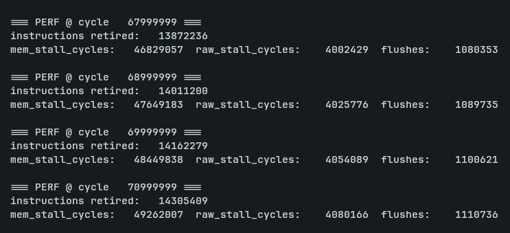

<BlogImage caption="DOOM Running on the new FPGA at 60fps">

</BlogImage>

It's quite a technicality to be honest. The actual out of order CPU is in the future, but let's go back a few steps.

## Thanks

Before I begin, I must thank a number of great people. Typically I'd save it for the end, but this blog physically wouldn't be possible without them, so it's rather relevant. First, thank you to [Peter Schmidt-Nielsen](https://peter.website/) and everyone at [Saturn Data](https://saturndata.com/). As I mentioned in my previous post, we borrowed an FPGA to run DOOM. A few days after getting DOOM to run smoothly, we had to return it. Peter, who had sent me his company's devboards in the past, offered to send their latest version. The latest board is a tremendously better FPGA than any I have used previously. It has over 7x the logic capabilities along with faster routing and more twice the RAM. This board let us run the CPU at twice the speed without any modifications. Without him and his company we would be stuck with just simulations until we sourced another board. 

Additionally, thank you to everyone at the [FLAME lab](https://flame.csail.mit.edu/) at MIT along with Professor Joel Emer. [Liam](https://www.outercloud.dev/) and I presented our [CPU running DOOM](https://armaangomes.com/blogs/doom/) to the FLAME Lab last week. Presenting to them was a blast, even though we dealt with a few technical issues. It turns out smart TVs don't like running at 480p. They had really good questions and suggestions about out design. `Professor Joel Emer` raised a question that stuck with me: How many memory requests are in flight?

Our CPU was architecturally similar to a standard 5 stage CPU that one might make in an intro computer architecture class, so it only had one data request in flight at any given time, stalling until it returned the request. To me, this seemed like the only option. Then he asked why we did that: the data is only needed the next time it is read. As we continued the presentation this stuck with me. What he was describing was a `non-blocking cache`.

## Implementation Details

It stuck with me so much that I went ahead that weekend and decided to implement it. To be honest this was a surprisingly trivial implementation. A non-blocking cache stores a buffer of memory requests and gradually fulfils them at its own pace. The new cache has up to 64 requests in flight at a given moment. When a load instruction is received it puts it into the queue and marks the destination register as busy. When the memory is eventually loaded, it returns to the register file and clears the busy marker. With stores, it just stores the write value and moves on. This might seem like a really small change. It is. In fact, most of the code changes took me less than 2 hours. However, there was quite a bit of deubugging as this new paradigm introduces more hazards that we had to deal with. I actually plan to implement full `MSHR (Miss Status Handling Registers)` next, which would allow multiple misses to be in flight at once to further improve bandwidth pressure.

## Other Improvements

In the last post I mentioned that the cache implementation was dumpster fire and laden with debt from previous assumptions. A large part of this was the fixed cache line width at 4 words per line. This has now been fixed and is fully parameterizable. It is currently set to 16 words per line. This turns the cache from dumpster fire to just a dumpster

Additionally, I added performance counters to track `IPC (Instructions Per Clock)`, Stalling, and Flushing so that we can easily benchmark the CPU. I plan to write a test program that expands on it as well to test a broad range of work loads. We might also just port CoreMark.

<BlogImage caption="Simulation showing Performance Counters">

</BlogImage>

## Performance Results

| Version |Rel Perf.| IPC | Clock Cycles | Instructions | Mem Stall | RAW Stall | Flushes|
|:-|:-|:-|:-|:-|:-|:-|:-|
| Original (Blocking Cache, 128 bit lines) | 100% | 0.433     | 100000000     | 43320963 | 33322506 | 16028335 | 4249431
| Larger Lines (Blocking Cache, 512 bit lines) | 109% | 0.475     | 100000000     | 47514103 | 28000892 | 17473484 | 4369018
| Non-Blocking Cache (128 bit lines) | 109% | 0.473     | 100000000     | 47345859 | 329163 | 42986154 | 4599374
| Both (Non-Blocking Cache, 512 bit lines) | 124% | 0.537    | 100000000     | 53725855 | 131006 | 36984028 | 5076654

As you can see in the table above, this results in a `24% increase` in IPC while running DOOM. This was tested with the assumption of 15 cycles per DRAM read. Is this realistic? Somewhat, but more importantly it's consistent. To be honest, it is probably an underestimation of DRAM latency in this case, but the benefits only grow as latency increases (as all of this work just hides the latency), so we are confident in the performance improvements. An interesting feature in these counters is the massive drop in mem stalls and increase in RAW stalls when the non-blocking cache is added due to the shift in memory/register pressure. Additionally, here are the numbers for the original and latest version with 50 cycle latency:

| Version |Rel Perf.| IPC | Clock Cycles | Instructions | Mem Stall | RAW Stall | Flushes|
|:-|:-|:-|:-|:-|:-|:-|:-|
| Original (Blocking Cache, 128 bit lines) | 100% | 0.217     | 100000000     | 21712802 | 67206354 | 6526252 | 1837154
| Both (Non-Blocking Cache, 512 bit lines) | 128% | 0.277    | 100000000     | 27713874 | 1171804 | 65759533 | 2763757

<BlogImage caption="We hit 60!">
<video src="/reel_06586be3.mp4" controls style="width:60%;border-radius:8px;" />
</BlogImage>

## Out of Order

This is technically out of order for the sole reason that instructions are not retired in exact sequential order. It does not include any instruction reordering or other significant improvements. This is just one component of a true out of order CPU. The full design is for later, make sure to keep an eye on Liam's blog for that one. 

Once again thanks to everyone that helped with this project so far. It's now time for me to add wifi and bluetooth. 