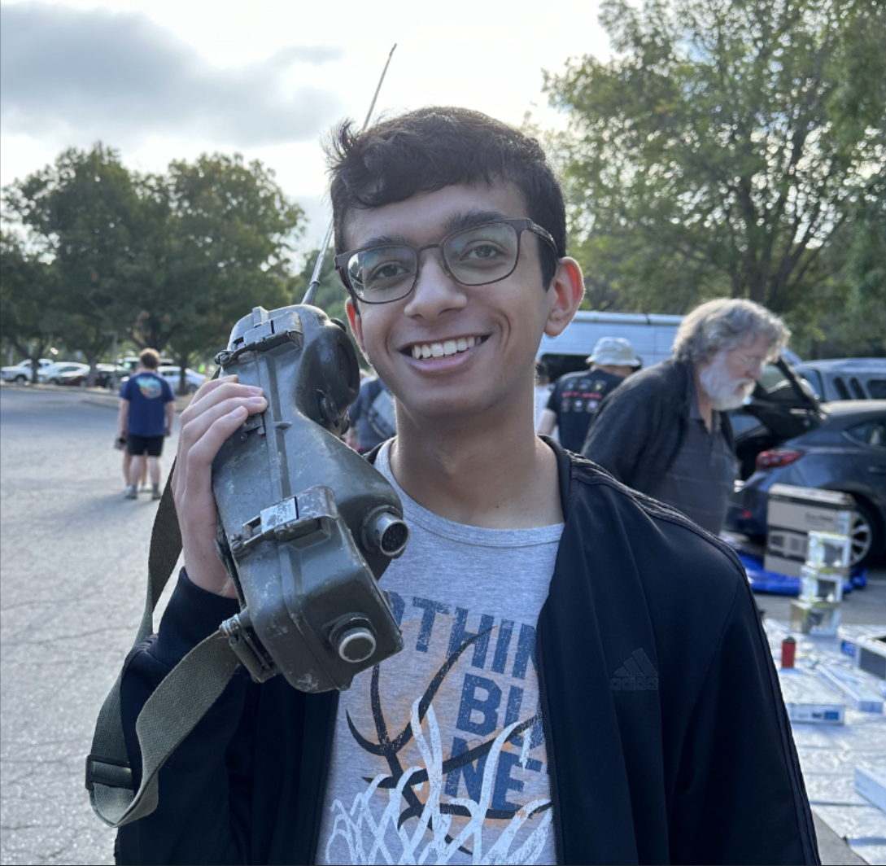

</img>

I'm Armaan Gomes, an EECS student at MIT. Welcome to my slice of the internet

I work on ASIC design, signal processing, and computer architecture — from beamforming hearing aids and ferroelectric capacitors to motor inverters and FPGA clusters. When I'm not wrangling chips or building my wildest ideas, I train taekwondo with my friends.
<BlockDiagram />

\> Check out my [projects](./projects.md), [experience](./experience.md), and [blog](./blog.md). <
- Or try visual navigation with the [graph](./graph.md)

If you want to hear what I listen to, some links play music (try the header and quotes)
 <!-- <NowPlaying />    -->

 "I want to live my life in such a way that when I get out of bed in the morning, the devil says, 'oh no, he's up.'" - <a href="https://www.youtube.com/watch?v=w3SS0Qh-xSY" onclick="if(window.__playMusic){window.__playMusic('s6Gjq-oxHEs','Larger Than Life','Pink Zebra');return false;}"> Steve Maraboli</a>

