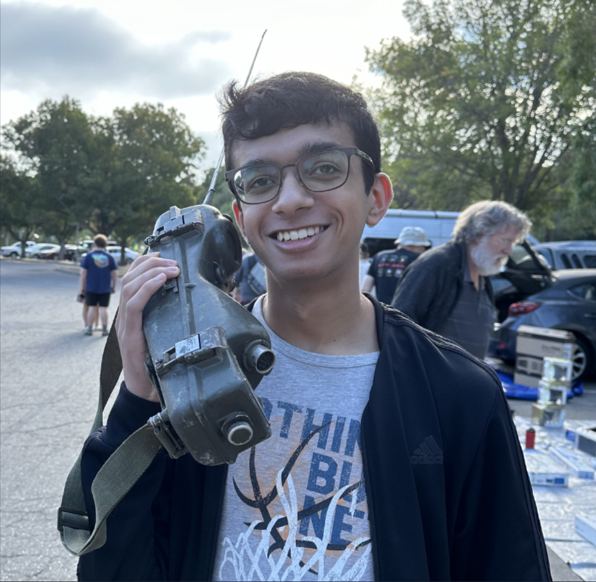

</img>

I'm Armaan.

I have an addiction.

 I'm addicted to chips. Back in grade school, I preferred Ruffles, really anything Wavy, but now my tastes are a lot less discerning. Nowadays, I'll take anything with Silicon, even Germanium, the smaller the features the better.

I'm an EECS student at MIT  who works on ASIC design, signal processing, and computer architecure. I've built beamforming hearing aids and fabricated beamforming ASICs, engineered ferroelectric capacitors and created my own NPU. My friends and I even designed a CPU that runs **[DOOM](./blogs/doom/index.md)**. Why? It seemed cool. If I'm not captivated by chip design, I'm probably either searching for mangos or training taekwondo with my friends. 

\> Check out my [projects](./projects.md), [experience](./experience.md), and [blog](./blog.md). <

If you want to hear what I listen to, some links play music (try the headline and quotes)

 "I want to live my life in such a way that when I get out of bed in the morning, the devil says, 'oh no, he's up.'" - <a href="https://www.youtube.com/watch?v=w3SS0Qh-xSY" onclick="if(window.__playMusic){window.__playMusic('s6Gjq-oxHEs','Larger Than Life','Pink Zebra');return false;}"> Steve Maraboli</a>

